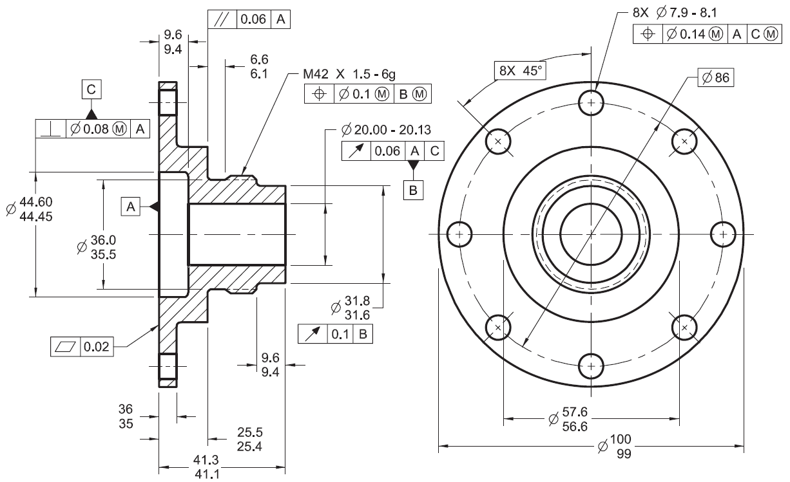

# Problem Statement -- Automating Drawing Analysis for Tolerance Feasibility
**Author:** Your Name  
**Project:** PSM Protech GmbH Project  
**Date:** *[Insert today's date]*

---

## Customer Problem (Engineering Perspective)

In the quotation phase at PSM Protech GmbH, customers submit detailed mechanical drawings containing dimensions, tolerances, GD&T symbols, and various callouts (commonly enclosed in ovals). Engineers must manually extract and interpret these symbols and values to assess manufacturability and process feasibility.

This manual extraction process is slow, error-prone, and highly repetitive — especially since a single drawing can contain over 500 callouts and multiple versions. Missing critical tolerances such as ±0.01 mm can lead to incorrect quotations, increased production costs, or delays. Automating this analysis can significantly improve speed, accuracy, and consistency in early design evaluation.

---

## Technical Problem (Machine Learning/Computer Vision Perspective)

To automate the interpretation of these engineering drawings, we propose a multi-stage pipeline using AI and computer vision:

- **Object Detection (YOLOv8):** Detect oval callouts and GD&T frames (feature control frames) in the drawing.
- **Image Classification:** Classify detected geometric tolerance symbols (e.g., flatness, roundness, perpendicularity) according to ISO 1101.
- **Optical Character Recognition (OCR):** Extract numerical tolerance values (e.g., ±0.05, ⌀10.2), text annotations (e.g., "CC", "3x"), and datums (A, B, C).
- **Rule-Based Classification:** Use customer-defined feasibility rules to classify dimensions as either feasible (green) or critical/infeasible (red).
- **(Optional) Version Comparison:** Highlight changes between drawing revisions for re-review.

---

*Figure: AI-based detection pipeline*
